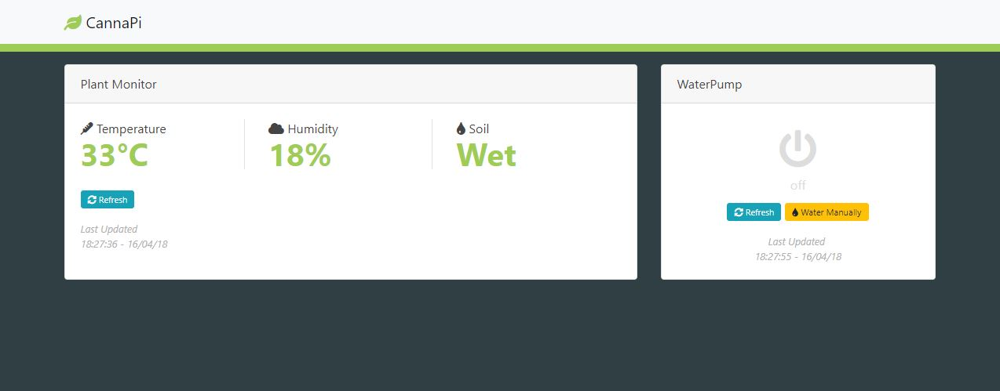

# cannapi-express
Web Dashboard for your garden.

- control your watering system from the comfort of your pc or mobile
- get an overview of your garden environment
- log all data to a mongodb database
- automate watering with cron
- automate probing and sending data to mongodb via cron
- [todo] camera live view

Hardware:
- Raspberry Pi 3
- SD Card
- 5V 3A Plug
- DHT11 Sensor
- Soil Moisture Sensor
- HDMI Cable
- Keyboard and Mouse

In order to speed up the development, we set our project up on both the Raspberry Pi and our development machine. They are mostly the same but we have to mock the functionality to acces GPIO ports on our dev machine, since this is Raspberry only.

Software:
- [MongoDB](https://www.mongodb.com/download-center#community)
- [NodeJS LTS](https://nodejs.org/en/)
- [Python 2.7.14](https://www.python.org/downloads/)
- [windows-build-tools](https://github.com/felixrieseberg/windows-build-tools)
- [vs2017 build tools](https://www.visualstudio.com/thank-you-downloading-visual-studio/?sku=BuildTools&rel=15)

on raspberry pi you'll need `"mongoose": "^4.0.14",` in your package.json

Stack:
- Backend: NodeJS running ExpressJS, Mongoose
- Frontend: VueJS, Vuex and axios

Clone the project and run yarn install.

Start the express server with yarn start and watch changes on the frontend source with yarn watch-fe
